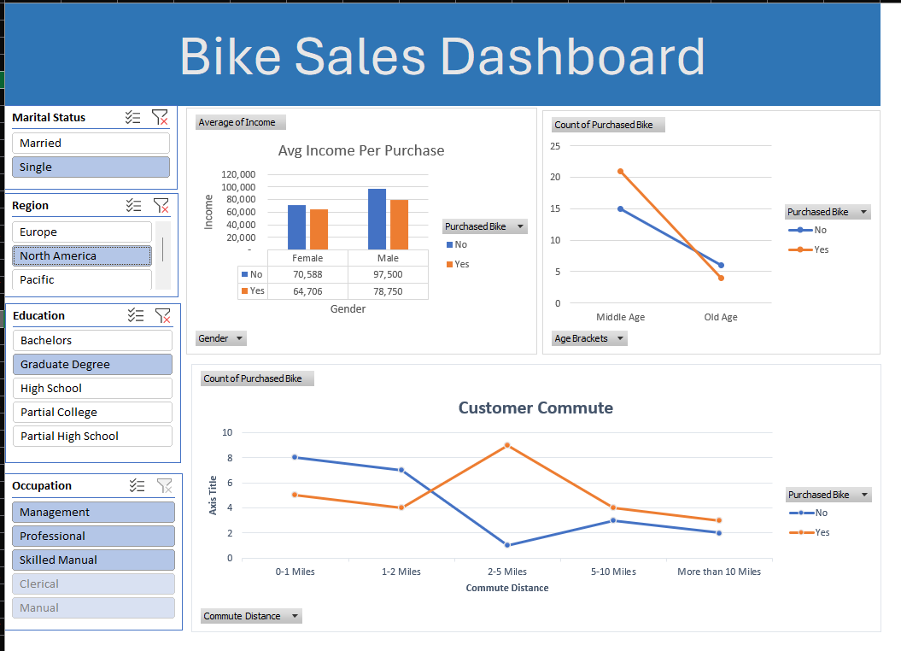
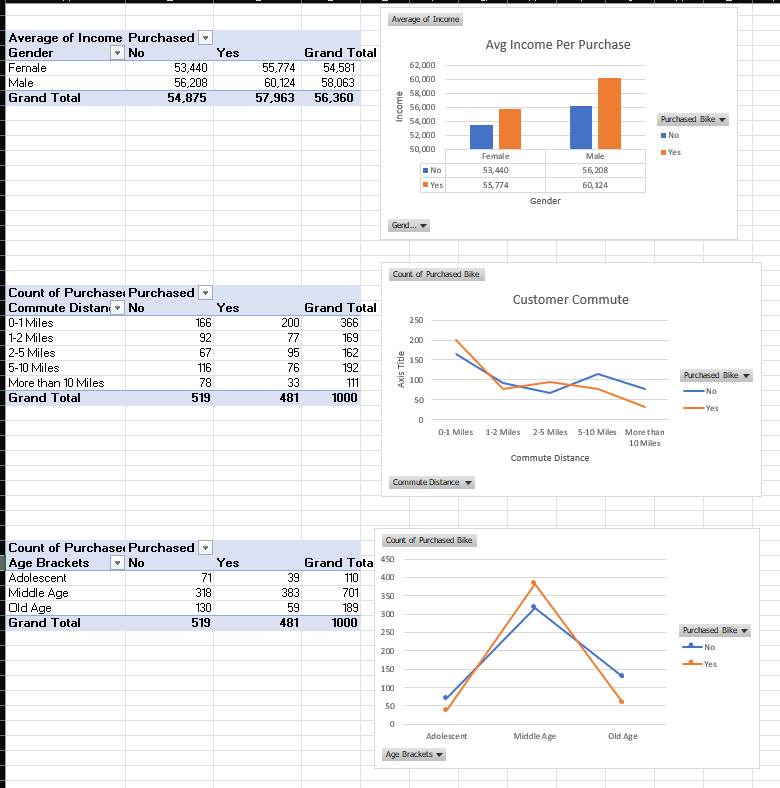

# Bike Sales Analysis - Excel Dashboard

## Project Overview

This project analyzes bike buyer data using Microsoft Excel. The workbook includes data preparation, data transformation, PivotTable analysis, and an interactive dashboard to explore customer purchasing patterns.

The project was created as a practical exercise to develop and demonstrate beginner-level data analysis skills using Excel.

## Dataset

The dataset contains customer information related to bike purchases, including:

- ID
- Marital Status
- Gender
- Income
- Children
- Education
- Occupation
- Home Owner
- Cars
- Commute Distance
- Region
- Age
- Purchased Bike

The workbook contains 1,027 rows in the original `bike_buyers` sheet.

## Project Workflow

### 1. Data Preparation

The original customer dataset was organized in Excel and prepared for analysis.

### 2. Data Transformation

A separate `Working Sheet` was created for analysis.

Transformations include:

- Converted Marital Status values into readable categories such as `Married` and `Single`
- Converted Gender values into `Female` and `Male`
- Created an `Age Brackets` column using an Excel IF formula
- Organized the data into a structured format for further analysis

The age categories used in the project are:

- Adolescent
- Middle Age
- Old Age

### 3. Data Analysis

PivotTables were used to analyze the prepared data.

The analysis includes comparisons such as:

- Average income by bike purchase status
- Average income by gender and bike purchase status
- Customer commute-related patterns

### 4. Dashboard

A `Dashboard` worksheet was created to present the analysis visually.

The dashboard includes charts for:

- Average Income Per Purchase
- Customer Commute
- Additional customer purchase analysis

The goal of the dashboard is to make the analysis easier to understand and communicate.

## Excel Skills Demonstrated

- Data preparation
- Data cleaning and transformation
- IF formulas
- Conditional categorization
- PivotTables
- Data analysis
- Data visualization
- Dashboard creation
- Basic business-oriented reporting

## Workbook Structure

| Sheet | Description |
|---|---|
| `bike_buyers` | Original customer dataset |
| `Working Sheet` | Prepared and transformed data |
| `Pivot Table` | PivotTable-based analysis |
| `Dashboard` | Visual dashboard and charts |

## Tools Used

- Microsoft Excel
- PivotTables
- Excel formulas
- Excel charts

## Project Files

- `Bike_Sales_Analysis.xlsx` - Complete Excel workbook containing the dataset, analysis, and dashboard.

## Learning Reference

This project was created as part of my practical learning in Excel and data analytics, using an Excel bike sales project tutorial by Alex The Analyst as a learning reference.

The project was used to practice the workflow of preparing data, analyzing it with PivotTables, and presenting findings through a dashboard.

## What I Learned

Through this project, I practiced:

- Preparing raw data for analysis
- Creating useful categories from existing data
- Using Excel formulas for data transformation
- Building PivotTables for analysis
- Creating charts and dashboards
- Organizing an Excel analysis project for a portfolio

## Author

**Sujan Chaudhary**

Aspiring Data Analyst | BSc IT Student

GitHub: [chaudharysujan586](https://github.com/chaudharysujan586)

## Dashboard Preview

## PivotTable Analysis

